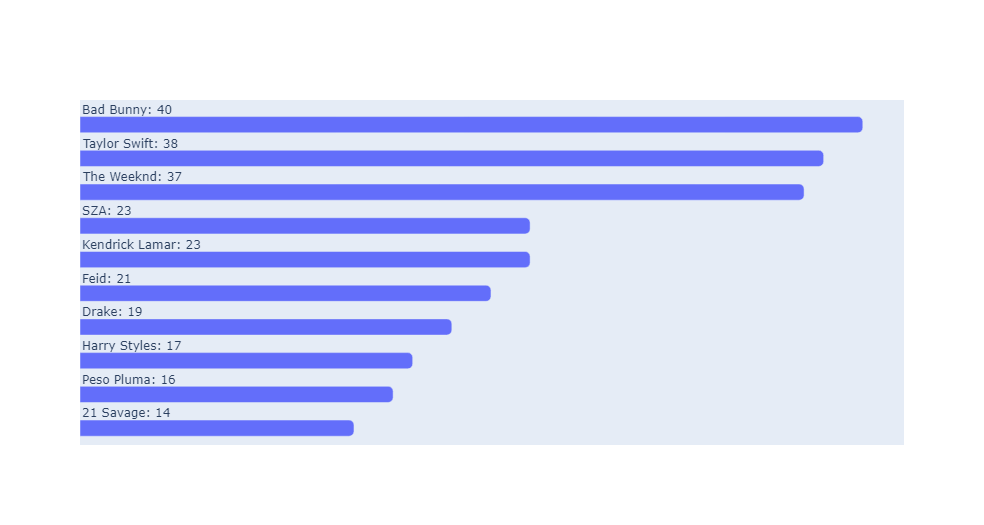
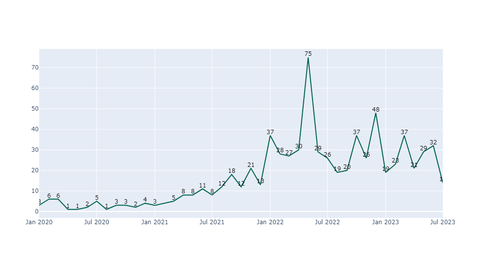
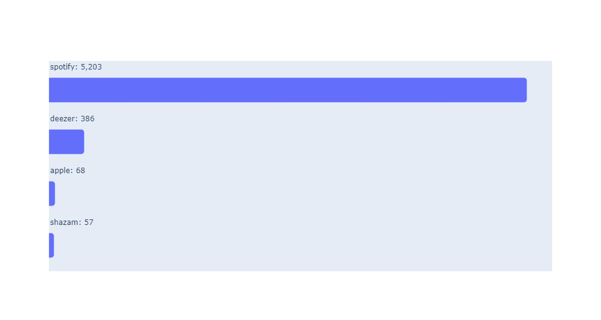
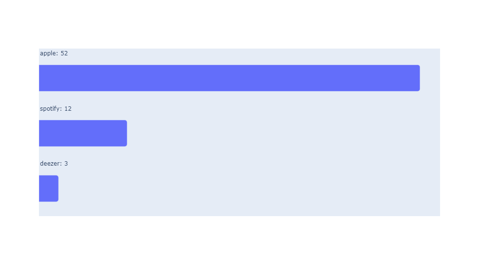
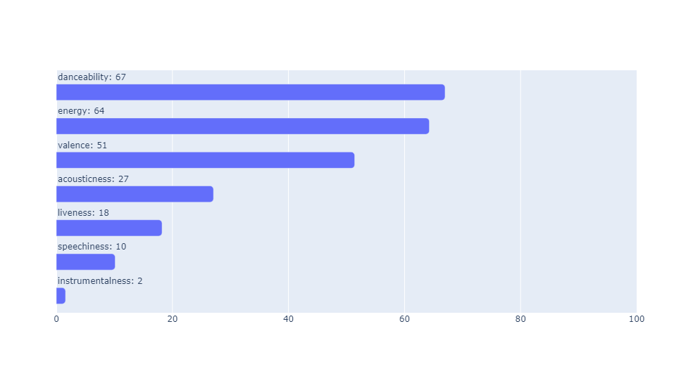

# Top tracks populars
Los datos que se ocupan en este Notebook son del siguiente link de kaggle : https://www.kaggle.com/datasets/zeesolver/spotfy

## Importar dependencias


```python
import pandas as pd
import numpy as np
import plotly.graph_objects as go
from datetime import date

pd.options.display.max_columns = None
# pd.options.display.max_rows = None
# pd.options.display.max_columns = 20 #Default
# pd.options.display.max_rows = 60 # Default
```

## Funciones


```python
def bar_label_h(df_col_label,df_col_value):
    fig = go.Figure(
        data=go.Bar(
                x=df_col_value, 
            ),
        layout={
            'bargroupgap':0.4, 
            'yaxis':{'visible': False},
            'xaxis':{'visible': False},
            'barcornerradius':5,
        })
    df_col_value = df_col_value.map('{:,.0f}'.format)
    label = df_col_label + ": " + df_col_value

    for idx, name in enumerate(label):
        fig.add_annotation(
            x=0,
            y=idx + 0.45,
            text=name,
            xanchor='left',
            showarrow=False,
            yshift=0
        )
    return fig

def line_interval(x,y,min_x=None,max_x=None):
    r_min = x.min() if min_x==None else date.fromisoformat(min_x)
    r_max = x.max() if max_x==None else date.fromisoformat(max_x)
    fig = go.Figure()
    fig.add_trace(go.Scatter(
        x=x, 
        y=y,
        text= y,
        textposition='top center',
        textfont=dict(color='#000000'),
        line_color='rgb(0,100,80)',
    ))
    fig.update_layout(
        xaxis = {'range':[r_min,r_max]}
    )
    fig.update_traces(mode='lines+text')
    return fig

def group_agg(df,ls):
    df = df[ls].mean()
    df = pd.DataFrame(data=df).reset_index()
    df.columns = ['type','value']
    return df
```

## Importar los datos


```python
data = pd.read_csv('Popular_Spotify_Songs.csv',encoding='latin1')
```

## Checamos el dataframe y alineamos el tipo de dato de cada columna


```python
data.info()
```

    <class 'pandas.core.frame.DataFrame'>
    RangeIndex: 953 entries, 0 to 952
    Data columns (total 24 columns):
     #   Column                Non-Null Count  Dtype 
    ---  ------                --------------  ----- 
     0   track_name            953 non-null    object
     1   artist(s)_name        953 non-null    object
     2   artist_count          953 non-null    int64 
     3   released_year         953 non-null    int64 
     4   released_month        953 non-null    int64 
     5   released_day          953 non-null    int64 
     6   in_spotify_playlists  953 non-null    int64 
     7   in_spotify_charts     953 non-null    int64 
     8   streams               953 non-null    object
     9   in_apple_playlists    953 non-null    int64 
     10  in_apple_charts       953 non-null    int64 
     11  in_deezer_playlists   953 non-null    object
     12  in_deezer_charts      953 non-null    int64 
     13  in_shazam_charts      903 non-null    object
     14  bpm                   953 non-null    int64 
     15  key                   858 non-null    object
     16  mode                  953 non-null    object
     17  danceability_%        953 non-null    int64 
     18  valence_%             953 non-null    int64 
     19  energy_%              953 non-null    int64 
     20  acousticness_%        953 non-null    int64 
     21  instrumentalness_%    953 non-null    int64 
     22  liveness_%            953 non-null    int64 
     23  speechiness_%         953 non-null    int64 
    dtypes: int64(17), object(7)
    memory usage: 178.8+ KB
    


```python
data['mode'].unique()
```


    array(['Major', 'Minor'], dtype=object)


Detectamos que las siguientes columnas deben tener la siguiente estructura

    -streams : float o int
    -in_deezer_playlists : float o int
    -in_shazam_charts : float o int

## Encontrar valores que no pueden cambiar de tipo a los tipos correctos

Primero creamos una funcion para validar / encontrar errores en el cambio de tipo

Despues la ejecutamos con las columnas en los cuales no poemos hacer el cambio de tipo


```python
def error_str_to_int(df_column,flg_print=True):    
    ls_error = []
    for i in df_column.unique():
        try:
            int(i)
        except:
            if len(ls_error) <6:
                if flg_print:
                    print(i)
            ls_error = ls_error + [i]
    if flg_print:
        print(f'EL numero de errores es {len(ls_error)}')
    return ls_error
#_____________________________________________________________
#Errores
dic_error = {}
ls_val = [
    'streams',
    'in_deezer_playlists',
    'in_shazam_charts',
]
for col_name in ls_val:
    print('________________________')
    print(col_name)
    ls_error = error_str_to_int(data[col_name])
    dic_error.update({col_name:ls_error})
```

    ________________________
    streams
    BPM110KeyAModeMajorDanceability53Valence75Energy69Acousticness7Instrumentalness0Liveness17Speechiness3
    EL numero de errores es 1
    ________________________
    in_deezer_playlists
    2,445
    3,394
    3,421
    4,053
    1,056
    4,095
    EL numero de errores es 76
    ________________________
    in_shazam_charts
    1,021
    1,281
    nan
    1,173
    1,093
    1,133
    EL numero de errores es 8
    

### streams

Observamos que existe un registro en el cual streams es una cadena de texto la cual no se puede transformar en numero float o int, streams es una columna importante para el analisis por lo que vamos a descartar este registro del analisis


```python
data = data[~data['streams'].isin(dic_error['streams'])]
data['streams'] = data['streams'].fillna(0).astype(float)
```

### in_shazam_charts y in_deezer_playlists
Observamos que el tema de esta columna es que los numero estan tienen formato de comas para separar cada 3 cifras (Miles y millones)

En el caso de **in_shazam_charts** los valores nulos los sustituimos por cero


```python
data['in_shazam_charts'] = data['in_shazam_charts'].str.replace(',','').fillna(0).astype(int)
data['in_deezer_playlists'] = data['in_deezer_playlists'].str.replace(',','').astype(int)
```


```python
data.info()
```

    <class 'pandas.core.frame.DataFrame'>
    Index: 952 entries, 0 to 952
    Data columns (total 24 columns):
     #   Column                Non-Null Count  Dtype  
    ---  ------                --------------  -----  
     0   track_name            952 non-null    object 
     1   artist(s)_name        952 non-null    object 
     2   artist_count          952 non-null    int64  
     3   released_year         952 non-null    int64  
     4   released_month        952 non-null    int64  
     5   released_day          952 non-null    int64  
     6   in_spotify_playlists  952 non-null    int64  
     7   in_spotify_charts     952 non-null    int64  
     8   streams               952 non-null    float64
     9   in_apple_playlists    952 non-null    int64  
     10  in_apple_charts       952 non-null    int64  
     11  in_deezer_playlists   952 non-null    int32  
     12  in_deezer_charts      952 non-null    int64  
     13  in_shazam_charts      952 non-null    int32  
     14  bpm                   952 non-null    int64  
     15  key                   857 non-null    object 
     16  mode                  952 non-null    object 
     17  danceability_%        952 non-null    int64  
     18  valence_%             952 non-null    int64  
     19  energy_%              952 non-null    int64  
     20  acousticness_%        952 non-null    int64  
     21  instrumentalness_%    952 non-null    int64  
     22  liveness_%            952 non-null    int64  
     23  speechiness_%         952 non-null    int64  
    dtypes: float64(1), int32(2), int64(17), object(4)
    memory usage: 178.5+ KB
    

Así dejamos alineado el dataframe en cuestion de los tipos

## Canciones con el mismo nombre
Observamos que existen tracks con el mismo nombre pero a nivel regitro hay diferencias así que vamos a suponer que son tracks distintos


```python
data['FLG_DUPLICATE'] = data.groupby('track_name',as_index=False)['track_name'].transform('count')
data_dup = data[data['FLG_DUPLICATE']>1].sort_values('track_name',ascending=False)
l_df_dup = len(data_dup)
l_df_dup_unique = len(data_dup.drop_duplicates())
mensaje = f'''
El tamaño de la tabla con nombres tracks duplicados es {l_df_dup}, 
quitando los duplicados a nivel registro son {l_df_dup_unique}
'''
print(mensaje)
```

    
    El tamaño de la tabla con nombres tracks duplicados es 20, 
    quitando los duplicados a nivel registro son 20
    
    

## Top de canciones
El top de canciones sera determinado por numero de streams


```python
data = data.sort_values('streams',ascending=False).reset_index(drop=True)
data = data.reset_index()
#Crear el top de canciones
data = data.rename(columns={'index':'top'})
data['top'] = data['top'] + 1
```


```python
data_top = data[data['top']<=10][['streams','track_name']]
data_top = data_top.sort_values('streams')
```


```python
bar_label_h(data_top['track_name'],data_top['streams'])
```

## Artistas con mayor numero de canciones
Primero observamos que hay canciones con más de un artista vease en la columna **artist_count**


```python
data[data['artist_count'] >1][['top','track_name','artist(s)_name']].head()
```


<div>
<style scoped>
    .dataframe tbody tr th:only-of-type {
        vertical-align: middle;
    }

    .dataframe tbody tr th {
        vertical-align: top;
    }

    .dataframe thead th {
        text-align: right;
    }
</style>
<table border="1" class="dataframe">
  <thead>
    <tr style="text-align: right;">
      <th></th>
      <th>top</th>
      <th>track_name</th>
      <th>artist(s)_name</th>
    </tr>
  </thead>
  <tbody>
    <tr>
      <th>4</th>
      <td>5</td>
      <td>Sunflower - Spider-Man: Into the Spider-Verse</td>
      <td>Post Malone, Swae Lee</td>
    </tr>
    <tr>
      <th>5</th>
      <td>6</td>
      <td>One Dance</td>
      <td>Drake, WizKid, Kyla</td>
    </tr>
    <tr>
      <th>6</th>
      <td>7</td>
      <td>STAY (with Justin Bieber)</td>
      <td>Justin Bieber, The Kid Laroi</td>
    </tr>
    <tr>
      <th>8</th>
      <td>9</td>
      <td>Closer</td>
      <td>The Chainsmokers, Halsey</td>
    </tr>
    <tr>
      <th>9</th>
      <td>10</td>
      <td>Starboy</td>
      <td>The Weeknd, Daft Punk</td>
    </tr>
  </tbody>
</table>
</div>


### Creación tabla secundaria con un registro por artista


```python
data_artist = data[['top', 'artist(s)_name']]
data_artist['artist(s)_name'] = data_artist['artist(s)_name'].apply(lambda x : x.split(', '))
data_artist = (
    data_artist[['top', 'artist(s)_name']]
    .set_index(['top'])['artist(s)_name']
    .apply(pd.Series)
    .stack()
    .reset_index(level=1, drop=True)
    .reset_index()
    .rename(columns={0:'artist(s)_name'})
)
```

```python
top_artist_clean = (
    data_artist
        .groupby('artist(s)_name',as_index=False)['top'].count()
        .sort_values('top',ascending=False)
        .reset_index(drop=True)
        .head(10)
)
top_artist_clean.columns = ['artist_clean','N Popular tracks clean']
top_artis = (
    data
        .groupby('artist(s)_name',as_index=False)['top'].count()
        .sort_values('top',ascending=False)
        .reset_index(drop=True)
        .head(10)
)
top_artis.columns = ['artist','N Popular tracks']
#Comparativa
top_comparative = top_artis.merge(top_artist_clean,left_index=True, right_index=True)
```


```python
top_artist_clean = top_artist_clean.sort_values('N Popular tracks clean')
```


```python
bar_label_h(top_artist_clean['artist_clean'],top_artist_clean['N Popular tracks clean'])
```



## Año de realización


```python
data['released_period'] = data['released_year'].astype(str) + '/' + data['released_month'].astype(str) + '/01'
data['released_period'] = pd.to_datetime(data['released_period'],yearfirst=True)
data_period =data.groupby(['released_period'],as_index=False)['top'].count()
```


```python
data_y = data.groupby(['released_year'],as_index=False)['top'].count()
```


```python
data_y['cumsum'] = (data_y['top'].cumsum() / data_y['top'].sum())*100
```


```python
data_y
```


<div>
<style scoped>
    .dataframe tbody tr th:only-of-type {
        vertical-align: middle;
    }

    .dataframe tbody tr th {
        vertical-align: top;
    }

    .dataframe thead th {
        text-align: right;
    }
</style>
<table border="1" class="dataframe">
  <thead>
    <tr style="text-align: right;">
      <th></th>
      <th>released_year</th>
      <th>top</th>
      <th>cumsum</th>
    </tr>
  </thead>
  <tbody>
    <tr>
      <th>0</th>
      <td>1930</td>
      <td>1</td>
      <td>0.105042</td>
    </tr>
    <tr>
      <th>1</th>
      <td>1942</td>
      <td>1</td>
      <td>0.210084</td>
    </tr>
    <tr>
      <th>2</th>
      <td>1946</td>
      <td>1</td>
      <td>0.315126</td>
    </tr>
    <tr>
      <th>3</th>
      <td>1950</td>
      <td>1</td>
      <td>0.420168</td>
    </tr>
    <tr>
      <th>4</th>
      <td>1952</td>
      <td>1</td>
      <td>0.525210</td>
    </tr>
    <tr>
      <th>5</th>
      <td>1957</td>
      <td>2</td>
      <td>0.735294</td>
    </tr>
    <tr>
      <th>6</th>
      <td>1958</td>
      <td>3</td>
      <td>1.050420</td>
    </tr>
    <tr>
      <th>7</th>
      <td>1959</td>
      <td>2</td>
      <td>1.260504</td>
    </tr>
    <tr>
      <th>8</th>
      <td>1963</td>
      <td>3</td>
      <td>1.575630</td>
    </tr>
    <tr>
      <th>9</th>
      <td>1968</td>
      <td>1</td>
      <td>1.680672</td>
    </tr>
    <tr>
      <th>10</th>
      <td>1970</td>
      <td>1</td>
      <td>1.785714</td>
    </tr>
    <tr>
      <th>11</th>
      <td>1971</td>
      <td>1</td>
      <td>1.890756</td>
    </tr>
    <tr>
      <th>12</th>
      <td>1973</td>
      <td>1</td>
      <td>1.995798</td>
    </tr>
    <tr>
      <th>13</th>
      <td>1975</td>
      <td>2</td>
      <td>2.205882</td>
    </tr>
    <tr>
      <th>14</th>
      <td>1979</td>
      <td>1</td>
      <td>2.310924</td>
    </tr>
    <tr>
      <th>15</th>
      <td>1982</td>
      <td>2</td>
      <td>2.521008</td>
    </tr>
    <tr>
      <th>16</th>
      <td>1983</td>
      <td>1</td>
      <td>2.626050</td>
    </tr>
    <tr>
      <th>17</th>
      <td>1984</td>
      <td>4</td>
      <td>3.046218</td>
    </tr>
    <tr>
      <th>18</th>
      <td>1985</td>
      <td>2</td>
      <td>3.256303</td>
    </tr>
    <tr>
      <th>19</th>
      <td>1986</td>
      <td>2</td>
      <td>3.466387</td>
    </tr>
    <tr>
      <th>20</th>
      <td>1987</td>
      <td>1</td>
      <td>3.571429</td>
    </tr>
    <tr>
      <th>21</th>
      <td>1991</td>
      <td>2</td>
      <td>3.781513</td>
    </tr>
    <tr>
      <th>22</th>
      <td>1992</td>
      <td>1</td>
      <td>3.886555</td>
    </tr>
    <tr>
      <th>23</th>
      <td>1994</td>
      <td>1</td>
      <td>3.991597</td>
    </tr>
    <tr>
      <th>24</th>
      <td>1995</td>
      <td>2</td>
      <td>4.201681</td>
    </tr>
    <tr>
      <th>25</th>
      <td>1996</td>
      <td>1</td>
      <td>4.306723</td>
    </tr>
    <tr>
      <th>26</th>
      <td>1997</td>
      <td>1</td>
      <td>4.411765</td>
    </tr>
    <tr>
      <th>27</th>
      <td>1998</td>
      <td>1</td>
      <td>4.516807</td>
    </tr>
    <tr>
      <th>28</th>
      <td>1999</td>
      <td>5</td>
      <td>5.042017</td>
    </tr>
    <tr>
      <th>29</th>
      <td>2000</td>
      <td>4</td>
      <td>5.462185</td>
    </tr>
    <tr>
      <th>30</th>
      <td>2002</td>
      <td>6</td>
      <td>6.092437</td>
    </tr>
    <tr>
      <th>31</th>
      <td>2003</td>
      <td>2</td>
      <td>6.302521</td>
    </tr>
    <tr>
      <th>32</th>
      <td>2004</td>
      <td>4</td>
      <td>6.722689</td>
    </tr>
    <tr>
      <th>33</th>
      <td>2005</td>
      <td>1</td>
      <td>6.827731</td>
    </tr>
    <tr>
      <th>34</th>
      <td>2007</td>
      <td>1</td>
      <td>6.932773</td>
    </tr>
    <tr>
      <th>35</th>
      <td>2008</td>
      <td>2</td>
      <td>7.142857</td>
    </tr>
    <tr>
      <th>36</th>
      <td>2010</td>
      <td>7</td>
      <td>7.878151</td>
    </tr>
    <tr>
      <th>37</th>
      <td>2011</td>
      <td>10</td>
      <td>8.928571</td>
    </tr>
    <tr>
      <th>38</th>
      <td>2012</td>
      <td>10</td>
      <td>9.978992</td>
    </tr>
    <tr>
      <th>39</th>
      <td>2013</td>
      <td>13</td>
      <td>11.344538</td>
    </tr>
    <tr>
      <th>40</th>
      <td>2014</td>
      <td>13</td>
      <td>12.710084</td>
    </tr>
    <tr>
      <th>41</th>
      <td>2015</td>
      <td>11</td>
      <td>13.865546</td>
    </tr>
    <tr>
      <th>42</th>
      <td>2016</td>
      <td>18</td>
      <td>15.756303</td>
    </tr>
    <tr>
      <th>43</th>
      <td>2017</td>
      <td>23</td>
      <td>18.172269</td>
    </tr>
    <tr>
      <th>44</th>
      <td>2018</td>
      <td>10</td>
      <td>19.222689</td>
    </tr>
    <tr>
      <th>45</th>
      <td>2019</td>
      <td>36</td>
      <td>23.004202</td>
    </tr>
    <tr>
      <th>46</th>
      <td>2020</td>
      <td>37</td>
      <td>26.890756</td>
    </tr>
    <tr>
      <th>47</th>
      <td>2021</td>
      <td>119</td>
      <td>39.390756</td>
    </tr>
    <tr>
      <th>48</th>
      <td>2022</td>
      <td>402</td>
      <td>81.617647</td>
    </tr>
    <tr>
      <th>49</th>
      <td>2023</td>
      <td>175</td>
      <td>100.000000</td>
    </tr>
  </tbody>
</table>
</div>


## Grafico de lineas
El 77% de los datos se encuentran a partir del 2020 por lo tanto el rango lo vemos a partir de 2020


```python
line_interval(data_period['released_period'],data_period['top'],'2020-01-01')
```


# Comparación
spoty
apple
deezer


```python
data
playlist = [
    'in_spotify_playlists',
    'in_apple_playlists',
    'in_deezer_playlists',
    'in_shazam_charts',
]
charts = [
    'in_spotify_charts',
    'in_apple_charts',
    'in_deezer_charts',
]
print('playlist')
print('_______________________________')
print(data[playlist].mean())
print('__________________________________________________')
print('charts')
print('_______________________________')
print(data[charts].mean())
```

    playlist
    _______________________________
    in_spotify_playlists    5202.565126
    in_apple_playlists        67.866597
    in_deezer_playlists      385.535714
    in_shazam_charts          56.907563
    dtype: float64
    __________________________________________________
    charts
    _______________________________
    in_spotify_charts    12.022059
    in_apple_charts      51.963235
    in_deezer_charts      2.669118
    dtype: float64
    


```python
data_playlist = group_agg(data,playlist)
data_playlist['type'] = data_playlist['type'].apply(lambda x : x.split('_')[1])
data_playlist = data_playlist.sort_values('value')
```

Observamos que spotify es donde los tracks mas escuchados tienen mayor promedio de playlis


```python
bar_label_h(data_playlist['type'],data_playlist['value'])
```



```python
data_charts = group_agg(data,charts)
data_charts['type'] = data_charts['type'].apply(lambda x : x.split('_')[1])
data_charts = data_charts.sort_values('value')
```

Observamos que apple es donde los tracks mas escuchados tienen mayor promedio de charts


```python
bar_label_h(data_charts['type'],data_charts['value'])
```



# Globalmente como estan ubicados los siguiente indicadores
    danceability_%
    valence_%
    energy_%
    acousticness_%
    instrumentalness_%
    liveness_%
    speechiness_%


```python
ls_indicator = [
    'danceability_%',
    'valence_%',
    'energy_%',
    'acousticness_%',
    'instrumentalness_%',
    'liveness_%',
    'speechiness_%',
]
print('_______________________________')
print('Indicadores')
print('_______________________________')
print(data[ls_indicator].mean())
print('_______________________________')
```

    _______________________________
    Indicadores
    _______________________________
    danceability_%        66.984244
    valence_%             51.406513
    energy_%              64.274160
    acousticness_%        27.078782
    instrumentalness_%     1.582983
    liveness_%            18.214286
    speechiness_%         10.138655
    dtype: float64
    _______________________________
    


```python
data_ind = group_agg(data,ls_indicator)
data_ind['type'] = data_ind['type'].apply(lambda x : x.split('_')[0])
data_ind = data_ind.sort_values('value')
ls_ind =data_ind.to_dict(orient='records')
```


```python
ind = bar_label_h(data_ind['type'],data_ind['value'])
ind.update_layout(
    xaxis = {'range':[0,100],'visible': True}
)
```

